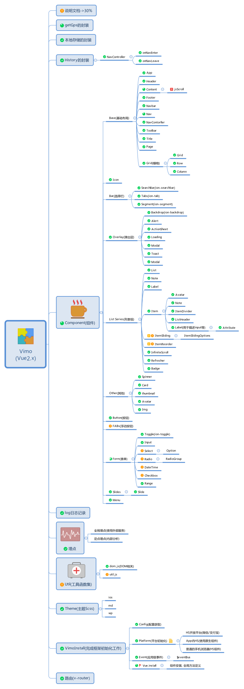

# Vimo

> 按照IONIC2.x的组件样式及API编写基于Vue2.X的组件，如果没读懂源码及思路, 千万别用与生产。

这个是目前的组件图谱, 基本上完成了90%.



项目使用vue-cli构建，如果对此熟悉则下面的启动说明应该就没问题了。

## 目录说明
```
|--backup			备份文件
|--build  			webpack配置文件
|--config  			webpack配置文件
|--Manuscript  		设计手稿
|--src				开发目录
|----assets			内部资源
|----views			业务页面(demo页面)
|----vimo			vimo组件及框架
|------component	组件
|------config		特性配置器
|------platform		平台配置器
|------theme		主题
|------transitions	过度的动画
|------util			工具
|------index.js		vimo安装入口
|----App.vue		主页面
|----main.js		入口js
|----router.js		路由
|----setting.js		业务设置
|--static			外部静态资源
|--test				测试
|--index.html		单页的index
```

## 文档生成

```
jsdoc ./src/vimo/components/**/** -c ./conf.json

```

## 安装运行

``` bash
# install dependencies
npm install

# serve with hot reload at localhost:8080
npm run dev

# build for production with minification
npm run build

# run unit tests
npm run unit

# run e2e tests
npm run e2e

# run all tests
npm test
```

