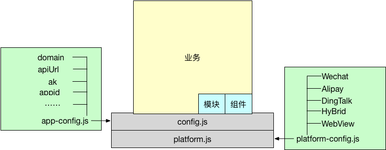

# Vimo
---

就目前来看，移动端H5的业务需求希望同样的页面能够在微信、支付宝、普通浏览器或者自建的App内部WebView中运行，因此使用一套代码完成上述需求。

.png)

从技术实现角度是没问题的，但是在维护层面会有些难度，需要在业务代码中插入很多环境判断的代码，这个和职责分离的设计思想相分离，故Vimo就是为了解决这个问题而开发。

Vimo的设计思想来源于IONIC2.x，通过研读源码并结合当前的问题，上述的问题是按照这个思路解决的：

App在运行之前，完成对当前运行环境的初始化，这部分由`config + plarform`完成，不同的平台配置及初始化通过`platform-config.js`完成。`app-config.js`完成业务层面的配置。

Vimo只安装必要的组件，模块根据需要自行安装。

## 框架技术清单(主要部分)

- vue 2.x
- vue-router 2.x
- webpack 2.x
- fastclick 1.x

## 版本信息

- 0.1.2 - 增加了转场动画及三级城市选择的picker组件
- 0.1.3 - 三级城市选择的picker组件debug, 增加微信初始化的代码
- 0.1.4 - 调整button组件
- 0.1.5 - 修复dom中的transitionEnd在打包中的问题
- 0.1.6 - 修复引用vimo后无法build的bug, 会因为源码为转为es5语法
- 0.1.7 - Navbar引入基础组件, Icon组件剔除对ionicons的依赖, 如果项目需要则自行安装`npm install ionicons`, 之后`import 'ionicons/dist/css/ionicons.css'`即可
- 0.1.8 - 修复`package.json`缺少依赖的问题
- 0.1.9 - platform增加onBridgeReady钩子, 平台初始化由platform自己完成, 其余的自定义部分由业务自己完成(比如: config配置, 分享配置等); 增加平台方法注册钩子`onBridgeReady`; 修复alert等组件的依赖关系.
- 0.2.0 - bridge设计完成(plt.registerMethod/this.$platform.do); searchbar/input组件debug; 明确基本组件为: App, Header, Footer, Content, Page, Nav, Button, Navbar, Toolbar, ToolbarTitle, ToolbarButtons, 其余按需加载.
- 0.2.1 - 去除refresher组件的console信息, 增加refresher-content组件的组件依赖.
- 0.2.2 - 修复modal打包后使用的bug
